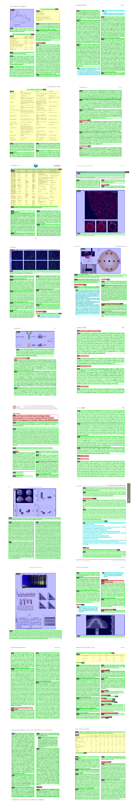

# PubLayNet

PubLayNet is a large dataset of document images, of which the layout is annotated with both bounding boxes and polygonal segmentations. The source of the documents is [PubMed Central Open Access Subset (commercial use collection)](https://www.ncbi.nlm.nih.gov/pmc/tools/openftlist/). The annotations are automatically generated by matching the PDF format and the XML format of the articles in the PubMed Central Open Access Subset. More details are available in our paper ["PubLayNet: largest dataset ever for document layout analysis."](https://arxiv.org/abs/1908.07836).

## Headlines

`07/Aug/2020` - PDF of document pages in PubLayNet is [released](https://dax-cdn.cdn.appdomain.cloud/dax-publaynet/1.0.0/PubLayNet_PDF.tar.gz).

`20/Jul/2020` - PubLayNet is used in [ICDAR 2021 Competition on Scientific Literature Parsing](https://github.com/IBM/ICDAR2021-SLP) ([Task A on Document Layout Recognition](https://aieval.draco.res.ibm.com/challenge/41/overview))

`26/Apr/2020` - PubLayNet is used by ICLR 2020 to [extract all the images](https://twitter.com/srush_nlp/status/1253788694739386371) in ICLR 2020 papers for promotion.

`03/Dev/2019` - Pre-trained Faster-RCNN model and Mask-RCNN model are [released](pre-trained-models).

`25/Nov/2019` - [**PubTabNet**](https://github.com/ibm-aur-nlp/PubTabNet) is released! PubTabNet is a large dataset for image-based table recognition, containing 568k+ images of tabular data annotated with the corresponding HTML representation of the tables. Table regions are identified using the same algorithm that generates PubLayNet.

`01/Nov/2019` - Our paper ["PubLayNet: largest dataset ever for document layout analysis."](https://arxiv.org/abs/1908.07836) receives the [**best paper award** at ICDAR 2019](http://icdar2019.org/award/)!

`31/Oct/2019` - PubLayNet migrates from Box to [**IBM Data Asset eXchange**](https://developer.ibm.com/exchanges/data/all/publaynet/).

## Updates in progress

### Ground truth of test set

The ground truth of test will not be release, as we want to keep it for a competition in the future. We will offer a service for people to submit and evaluate their results soon.

## Getting data

Images and annotations can be downloaded [here](https://developer.ibm.com/exchanges/data/all/publaynet/). The training set is quite large, so two options are offered. We split the training set into 7 batches, which can be separately downloaded. Or you can also download the full set at once.

For the ICDAR competition, ids of the image files are available [here](https://github.com/ibm-aur-nlp/PubLayNet/blob/master/ICDAR_SLR_competition/test_ids.json).

If direct download in browser is unstable or you want to download the data from the command line, you can use curl or wget to download the data.

```
curl -o <YOUR_TARGET_DIR>/publaynet.tar.gz https://dax-cdn.cdn.appdomain.cloud/dax-publaynet/1.0.0/publaynet.tar.gz
```

```
wget -O <YOUR_TARGET_DIR>/publaynet.tar.gz https://dax-cdn.cdn.appdomain.cloud/dax-publaynet/1.0.0/publaynet.tar.gz
```

To download the PDFs of the document pages contained in PubLayNet:

```
curl -o <YOUR_TARGET_DIR>/PubLayNet_PDF.tar.gz https://dax-cdn.cdn.appdomain.cloud/dax-publaynet/1.0.0/PubLayNet_PDF.tar.gz
```

```
wget -O <YOUR_TARGET_DIR>/PubLayNet_PDF.tar.gz https://dax-cdn.cdn.appdomain.cloud/dax-publaynet/1.0.0/PubLayNet_PDF.tar.gz
```

## Annotation format

The annotation files follows the [json format of the Object Detection task of MS COCO](http://cocodataset.org/#format-data)

## Cite us

```
@inproceedings{zhong2019publaynet,
  title={PubLayNet: largest dataset ever for document layout analysis},
  author={Zhong, Xu and Tang, Jianbin and Yepes, Antonio Jimeno},
  booktitle={2019 International Conference on Document Analysis and Recognition (ICDAR)},
  year={2019},
  volume={},
  number={},
  pages={1015-1022},
  doi={10.1109/ICDAR.2019.00166},
  ISSN={1520-5363},
  month={Sep.},
  organization={IEEE}
}
```

## Examples

A [Jupyter notebook](./exploring_PubLayNet_dataset.ipynb) is provided to generate the following visualization of the annotations of 20 sample pages.



